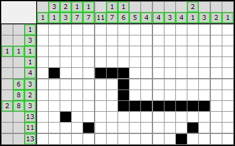

# Nonogram Computer Vision
This project aims to take nonograms from the website www.nonograms.org/ and translate them into a computer list format which can be then used to solve and show the completed nonogram.

The nonograms used to run this should be gathered from [here](www.nonograms.org/) and saved in a locally accessible folder.
Testing has be performed to ensure it works with PNG image file type others may be supported.

## Requirements
- [Python 3.10](https://www.python.org/downloads/)
- [CV2](https://pypi.org/project/opencv-python/)
- [Numpy](https://numpy.org/)
- [Pytesseract](https://pypi.org/project/pytesseract/)
- [Tesseract](https://pythonforundergradengineers.com/how-to-install-pytesseract.html)

You can then use the command
```
where tesseract
```
and at the top of Finale.ipynb insert this file location which will allow pyTesseract to interact with Tesseract.

Each is easily installed using [anaconda](https://www.anaconda.com/) console which makes managing python environments very easy.

# Examples
```
Horizontal Hints:
[[1], [3], [1, 1, 1], [1], [4], [6, 3], [8, 2], [2, 8, 3], [13], [11], [13]]
```
```
Vertical Hints: 
[[1], [3, 1], [2, 3], [1, 7], [1, 7], [11], [1, 7], [1, 6], [5], [4], [4], [3], [4], [2, 1], [3], [2], [1]]
```



